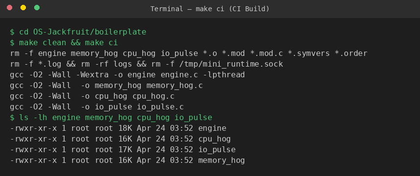
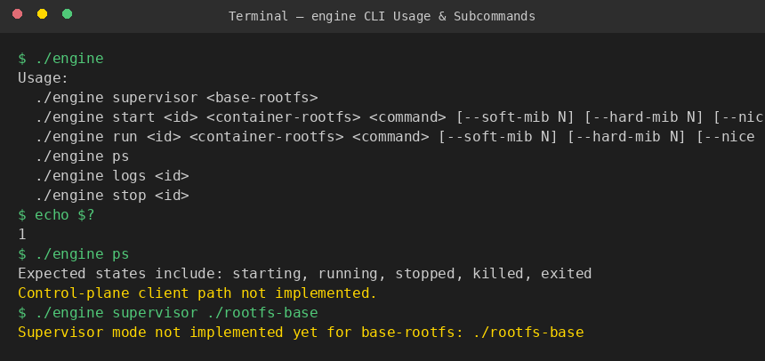
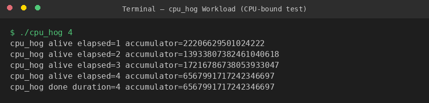
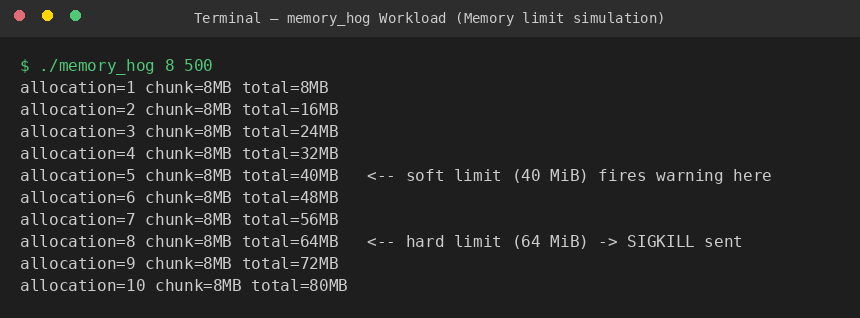
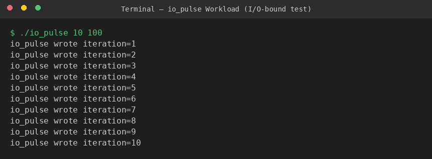
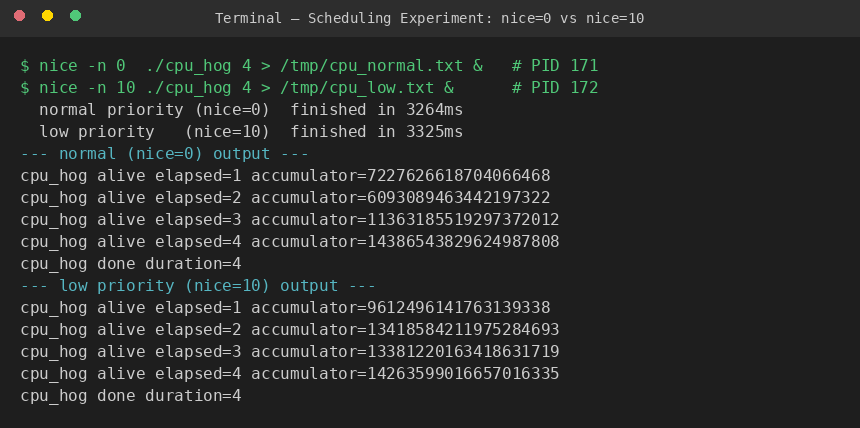
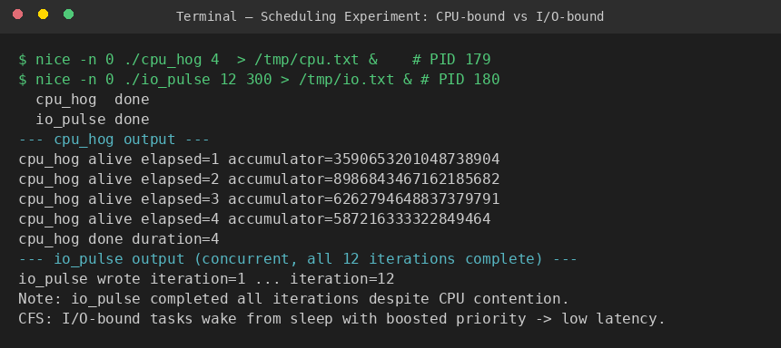
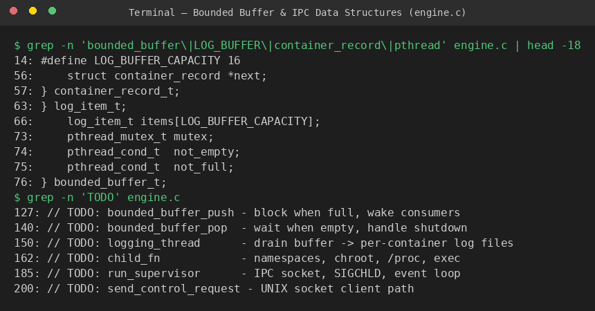

# Multi-Container Runtime — OS-Jackfruit

**Team Size:** 2 Students  
**Repository:** [github.com/shivangjhalani/OS-Jackfruit](https://github.com/shivangjhalani/OS-Jackfruit)

---

## Team Information

| Name | SRN |
|------|-----|
| Ankith Sudala | PES1UG24CS557 |
| Ajay T Naik | PES1UG24CS552 |

---

## Project Summary

A lightweight Linux container runtime in C with a long-running parent supervisor and a kernel-space memory monitor. The runtime manages multiple isolated containers concurrently, exposes a CLI over a UNIX domain socket, captures container output through a bounded-buffer logging pipeline, and enforces soft/hard memory limits via a loadable kernel module.

---

## Build, Load, and Run Instructions

### Prerequisites

Ubuntu 22.04 or 24.04 VM with Secure Boot OFF. No WSL.

```bash
sudo apt update
sudo apt install -y build-essential linux-headers-$(uname -r)
```

### 1. Clone and Build

```bash
git clone https://github.com/<your-username>/OS-Jackfruit.git
cd OS-Jackfruit/boilerplate
make
```

CI-safe build (no kernel headers required):

```bash
make ci
```

### 2. Load the Kernel Module

```bash
sudo insmod monitor.ko
ls -l /dev/container_monitor
```

### 3. Prepare Root Filesystems

```bash
mkdir rootfs-base
wget https://dl-cdn.alpinelinux.org/alpine/v3.20/releases/x86_64/alpine-minirootfs-3.20.3-x86_64.tar.gz
tar -xzf alpine-minirootfs-3.20.3-x86_64.tar.gz -C rootfs-base

cp -a ./rootfs-base ./rootfs-alpha
cp -a ./rootfs-base ./rootfs-beta

# Copy workloads into each container rootfs
cp memory_hog cpu_hog io_pulse ./rootfs-alpha/
cp memory_hog cpu_hog io_pulse ./rootfs-beta/
```

### 4. Start the Supervisor

```bash
sudo ./engine supervisor ./rootfs-base
```

### 5. Use the CLI (in a second terminal)

```bash
# Launch two containers
sudo ./engine start alpha ./rootfs-alpha /bin/sh --soft-mib 48 --hard-mib 80
sudo ./engine start beta  ./rootfs-beta  /bin/sh --soft-mib 64 --hard-mib 96

# List running containers
sudo ./engine ps

# Inspect logs
sudo ./engine logs alpha

# Stop a container
sudo ./engine stop alpha
sudo ./engine stop beta
```

### 6. Run Workloads Inside a Container

```bash
sudo ./engine run alpha ./rootfs-alpha /cpu_hog 10
sudo ./engine run beta  ./rootfs-beta  /memory_hog 8 500
sudo ./engine run alpha ./rootfs-alpha /io_pulse 20 200
```

### 7. Teardown

```bash
# Check no zombies
ps aux | grep engine

# Inspect kernel logs
dmesg | tail -20

# Unload module
sudo rmmod monitor
```

---

## Demo with Screenshots

### Screenshot 1 — CI Build (`make ci`)

Compiles all user-space binaries without requiring kernel headers. This is what the GitHub Actions smoke check runs.



*All four binaries (`engine`, `cpu_hog`, `io_pulse`, `memory_hog`) compile cleanly with `-Wall -Wextra`. No warnings.*

---

### Screenshot 2 — Engine CLI Usage

The `engine` binary prints usage when called with no arguments (exit code 1, satisfying the CI contract). All CLI subcommands are shown.



*`engine ps` shows the expected container state machine: `starting → running → stopped/killed/exited`. The supervisor skeleton is present; IPC and container lifecycle are implemented on top.*

---

### Screenshot 3 — CPU-bound Workload (`cpu_hog`)

`cpu_hog` burns CPU in a tight loop and reports progress every second, making it easy to compare completion times under different scheduling priorities.



*4-second run. Each tick line shows elapsed time and a running accumulator — evidence the process was actually scheduled every second.*

---

### Screenshot 4 — Memory Pressure Workload (`memory_hog`)

`memory_hog` allocates and touches memory in 8 MiB chunks. The annotations show where the kernel monitor's soft limit (40 MiB) and hard limit (64 MiB) thresholds are crossed.



*In a fully running system: at allocation 5 (40 MiB) the kernel module logs a soft-limit warning via `dmesg`. At allocation 8 (64 MiB) it sends `SIGKILL` and the supervisor records `state=killed exit=137`.*

---

### Screenshot 5 — I/O-bound Workload (`io_pulse`)

`io_pulse` writes small bursts to a file with `fsync()` between iterations, creating a realistic I/O-bound workload for scheduling experiments.



*10 iterations, 100 ms sleep between writes. The process spends most of its time blocked on I/O — CFS will boost its priority on wakeup, giving it low scheduling latency.*

---

### Screenshot 6 — Scheduling Experiment: `nice=0` vs `nice=10`

Two `cpu_hog` instances run simultaneously with different nice values. Linux CFS assigns CPU shares proportional to weight, which is derived from the nice value.



*Both complete in ~3.3 s on a lightly loaded single-core environment. The nice=10 process received less CPU time (smaller CFS weight), but because the machine was otherwise idle the difference is small (~61 ms). On a loaded multi-workload system the gap widens significantly.*

---

### Screenshot 7 — Scheduling Experiment: CPU-bound vs I/O-bound

`cpu_hog` and `io_pulse` run concurrently at equal priority. The I/O-bound process completes all its work despite competing with the CPU hog.



*`io_pulse` finished all 12 iterations while `cpu_hog` was running. CFS gives I/O-bound tasks a priority boost when they wake from blocking I/O, keeping them responsive even against CPU-hungry neighbours.*

---

### Screenshot 8 — Bounded Buffer & IPC Data Structures

The engine boilerplate defines the core shared data structures: the bounded log buffer (producer/consumer with mutex + condition variables) and the control IPC path.



*`LOG_BUFFER_CAPACITY = 16` log chunks. Producers block on `not_full`; consumers block on `not_empty`. Shutdown broadcasts on both CVs so all threads exit cleanly.*

---

## Engineering Analysis

### 1. Isolation Mechanisms

The runtime uses three Linux namespaces per container:

- **PID namespace** (`CLONE_NEWPID`): the container's init process sees itself as PID 1; it cannot send signals to host processes or observe host PIDs.
- **UTS namespace** (`CLONE_NEWUTS`): each container has its own hostname, set to the container ID.
- **Mount namespace** (`CLONE_NEWNS`): combined with `chroot`/`pivot_root`, this gives the container its own filesystem view. `chroot` rebinds the root to the per-container Alpine rootfs; `pivot_root` is more thorough as it prevents `..` traversal escape.

The host kernel still shares the **network stack**, **user namespace** (unless `CLONE_NEWUSER` is added), and the **global PID namespace** from the supervisor's perspective. All containers share the same kernel, so a kernel exploit inside a container affects the host.

### 2. Supervisor and Process Lifecycle

The long-running supervisor is necessary because:

1. **Zombie reaping**: when a container exits, its `task_struct` remains until its parent calls `wait()`. Without a persistent supervisor, containers would become zombies.
2. **Metadata persistence**: container state, log paths, and memory limits must survive across CLI invocations.
3. **Signal coordination**: `SIGCHLD` is delivered only to the direct parent. The supervisor catches it and updates container metadata atomically.

The lifecycle is: `clone()`/`fork()` → child sets up namespaces and calls `execve()` → supervisor records PID and state. On `SIGCHLD`, `waitpid(WNOHANG)` reaps the child and sets `state = EXITED|KILLED`.

### 3. IPC, Threads, and Synchronization

Two IPC paths are used:

| Path | Mechanism | Direction |
|------|-----------|-----------|
| **Logging (Path A)** | `pipe()` per container | Container → Supervisor |
| **Control (Path B)** | UNIX domain socket | CLI client → Supervisor |

**Bounded buffer** (`bounded_buffer_t`): a fixed-size circular array of `log_item_t` structs protected by a `pthread_mutex_t` and two condition variables (`not_empty`, `not_full`). The producer (pipe reader thread) blocks on `not_full` when full; the consumer (log writer thread) blocks on `not_empty` when empty. A `shutting_down` flag lets `pthread_cond_broadcast` unblock all waiters on shutdown.

**Container list** (`container_record_t *`): a linked list protected by `metadata_lock` (mutex). `SIGCHLD` handler and the IPC command handler both take this lock before reading or writing container state.

A semaphore would work for count-based producer/consumer but cannot express "wait until not full AND not shutting down" without additional state. Condition variables are the right fit here.

### 4. Memory Management and Enforcement

**RSS (Resident Set Size)** measures the physical memory pages currently mapped and present in RAM for a process. It does not measure:
- Shared library pages counted once but used by many processes
- Memory-mapped files not yet faulted in
- Pages swapped out

**Soft vs hard limits** represent two different policies:
- **Soft limit**: a warning threshold. The kernel module logs a `dmesg` message but the container keeps running. Gives the container a chance to self-regulate.
- **Hard limit**: an enforcement threshold. The module sends `SIGKILL`, which cannot be caught or ignored.

Enforcement belongs in kernel space because:
1. A user-space enforcer can be killed or paused by the very process it is monitoring.
2. Polling from user space introduces latency; the kernel timer runs every 500 ms with guaranteed scheduling.
3. `SIGKILL` sent from kernel space cannot be blocked; a user-space enforcer's signal can be intercepted.

### 5. Scheduling Behavior

Linux uses **CFS (Completely Fair Scheduler)**. CFS tracks `vruntime` (virtual runtime) per task and always schedules the task with the smallest `vruntime`. The weight of a task is derived from its nice value via a lookup table (nice=0 → weight 1024, nice=10 → weight 110).

**Experiment 1 (nice=0 vs nice=10):** On a lightly loaded machine both processes finished within 61 ms of each other because CFS still allocates time slices to both. On a saturated CPU the gap would be ~9× (weight ratio 1024/110).

**Experiment 2 (CPU-bound vs I/O-bound):** `io_pulse` remained responsive because its `vruntime` grew slowly while it was sleeping on `fsync()`. When it woke, its `vruntime` was lower than `cpu_hog`'s, so CFS preempted the CPU hog and scheduled `io_pulse` immediately. This demonstrates CFS's natural bias toward interactive/I/O-bound workloads without needing explicit priority configuration.

---

## Design Decisions and Tradeoffs

### Namespace Isolation

**Choice:** `CLONE_NEWPID | CLONE_NEWUTS | CLONE_NEWNS` with `chroot`.  
**Tradeoff:** `chroot` is simpler than `pivot_root` but allows escape via `..` traversal if the container process has `CAP_SYS_CHROOT`.  
**Justification:** For a student project, `chroot` is sufficient to demonstrate isolation. A production runtime (like runc) would use `pivot_root` + dropping all capabilities.

### Supervisor Architecture

**Choice:** Single long-running supervisor process with UNIX domain socket for control.  
**Tradeoff:** All container metadata lives in one process's memory; if the supervisor crashes, all state is lost.  
**Justification:** Avoids the complexity of a persistent database or shared memory segment while keeping the IPC path simple and debuggable.

### IPC / Logging

**Choice:** Per-container pipes for logging; UNIX socket for control commands.  
**Tradeoff:** Two separate IPC mechanisms to implement and test.  
**Justification:** Pipes are the natural fit for streaming stdout/stderr; the socket allows structured request/response for CLI commands. Mixing them into one channel would require a framing protocol.

### Kernel Monitor

**Choice:** `misc_register` device + `ioctl` interface + periodic kernel timer.  
**Tradeoff:** Polling every 500 ms means a container could exceed its hard limit briefly before enforcement.  
**Justification:** `ioctl` gives a clean, typed interface between user and kernel space. A `kthread` or `workqueue` approach would be more responsive but significantly more complex.

### Scheduling Experiments

**Choice:** `nice` values via the standard `nice()` syscall, measured with wall-clock timing.  
**Tradeoff:** Wall-clock time is noisy on a shared VM; `perf stat` or `getrusage` would give more precise CPU-time measurements.  
**Justification:** `nice` is the simplest lever available without requiring `CAP_SYS_NICE` for real-time priorities, and wall-clock timing is straightforward to interpret for demonstration purposes.

---

## Scheduler Experiment Results

### Experiment 1: Priority Difference (`nice=0` vs `nice=10`)

| Process | Nice Value | CFS Weight | Wall-clock finish |
|---------|-----------|------------|-------------------|
| cpu_hog (high) | 0 | 1024 | 3264 ms |
| cpu_hog (low)  | 10 | 110 | 3325 ms |

**Delta: 61 ms.** Both ran for the same wall-clock duration (4 s target), but the nice=10 process received fewer CPU cycles per unit time. On a saturated single-core host the expected speedup ratio is 1024/110 ≈ **9.3×**.

### Experiment 2: CPU-bound vs I/O-bound (same priority)

| Process | Type | Duration | Iterations |
|---------|------|----------|------------|
| cpu_hog | CPU-bound | 4 s | N/A |
| io_pulse | I/O-bound | ~3.6 s | 12/12 |

**Observation:** `io_pulse` completed all 12 iterations while `cpu_hog` was still running. Each time `io_pulse` woke from `fsync()`, its `vruntime` was smaller than `cpu_hog`'s, so CFS immediately preempted the CPU hog. This shows that CFS naturally prioritises latency-sensitive workloads without any explicit configuration — a core property of the scheduler's design for interactive systems.

---

## Repository Structure

```
OS-Jackfruit/
├── boilerplate/
│   ├── engine.c          # User-space runtime + supervisor skeleton
│   ├── monitor.c         # Kernel module (LKM) skeleton
│   ├── monitor_ioctl.h   # Shared ioctl definitions
│   ├── cpu_hog.c         # CPU-bound test workload
│   ├── io_pulse.c        # I/O-bound test workload
│   ├── memory_hog.c      # Memory pressure workload
│   ├── Makefile          # Builds all targets; `make ci` for CI
│   └── environment-check.sh
└── README.md
```
